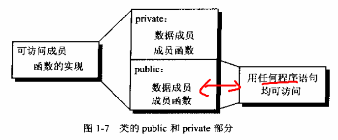
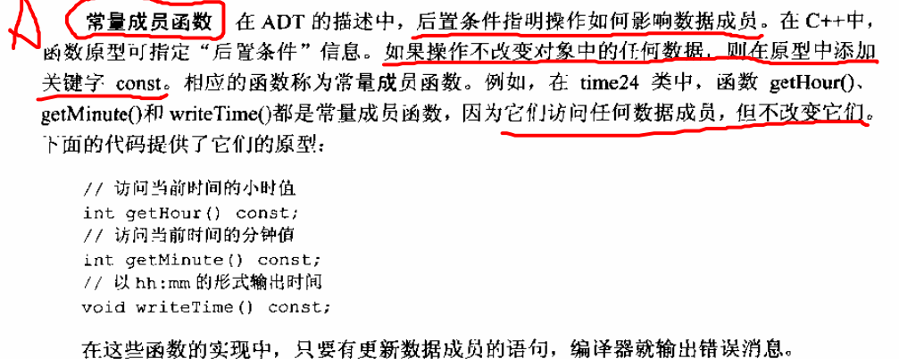
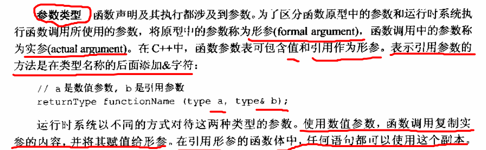
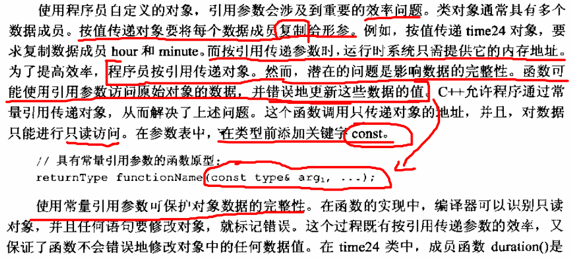

# 第一章
## 1. 类class 介绍
1.通常，类的声明是把数据成员放入 private 部分。

## 2.函数成员变量
**1）常量成员函数**
==（1）后置条件：指明操作如何影响数据成员。==
（2）若操作不改变对象中的任何数据，则在原型中添加关键字 const， 它们访问任何数据成员，但是不改变它们。

**2）参数类型**

按值参数和引用参数
按值传递：将每个数据成员复制给形参
引用传递：运用时系统只需要提供它的内存地址，有个问题，函数可以使用引用参数访问原始对象的数据，并且错误的更新这些数据的值。为解决这个问题，常在类型前面添加关键字 const，数据只读，保护数据的完整性。
**使用引用事，相当于使用 ‘别名’**
